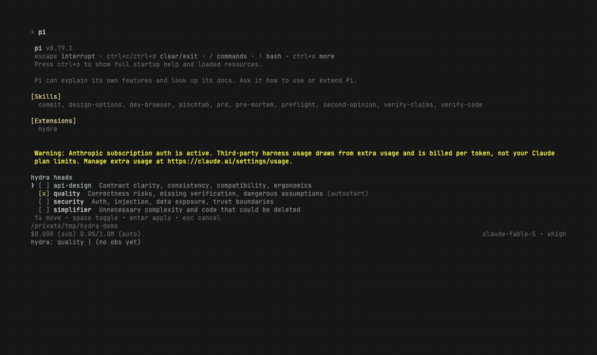

# pi-hydra

[](https://github.com/pandysp/pi-hydra/actions/workflows/ci.yml)

> Extra heads for your coding agent.



hydra is a [pi](https://pi.dev/) extension that adds live oversight to your coding agent: heads that review the agent's work while the agent is still working. Each head reviews through its own lens (quality, security, simplifier, API design, or anything you write). It sees exactly what the agent sees, judges every step, and delivers each finding: print a note for you, steer the agent at its next checkpoint, or interrupt the run. Heads can act, too: by default a head may read, search, run, and write through the agent's own tools before it decides (a docs head keeps notes current while the agent codes). One body, many heads: the agent carries the context, and each additional head reads that context straight from the prompt cache. An observation costs a cache read instead of a context rebuild; total overhead depends on provider, task, and how much the head reports ([What it costs](#what-it-costs)).

## Why

Review usually happens after the work. The PR is finished, a reviewer (human or agent) loads the whole trajectory into fresh context at full price, and the findings arrive when the design is already set, so fixing them means rework. The same goes for evaluating agent behavior: replaying a finished trajectory into an eval agent costs full input price and happens too late to change anything.

hydra inverts this. Observation happens during the run, at the exact moments the agent's own prompt cache commits, so a second perspective costs the observation prompt plus a cache read (numbers in [What it costs](#what-it-costs)). The decision usually lands while the agent's response is still streaming, early enough to steer the next step instead of rewriting a finished PR.

A bad assumption caught mid-implementation costs one correction message, and the same assumption caught in review costs a refactor.

## What it costs

An observation pays for its fresh handoff and output plus a cache read. Measured cache hit rates are 97%+ across real Anthropic sessions (a 17K-token session measured 99%); OpenAI Codex measures ~84–87% ([why](docs/architecture.md#cache-hit-ratio)).

A session costs more than one observation suggests because an always-on head watches every cache commit. On live Anthropic sessions, an always-on head cost between 32.5% and 61.4% of what the driver itself cost (the driver is pi's main agent, the one you talk to). On OpenAI Codex, the registered measurement wave put the shipped judge contract at 77.0% of driver cost over its 108 cache-comparable observations, and a single-finding baseline contract at 52.1% over 103; keeping every charged call, cache misses included, raises those ratios to 93.3% and 66.2%. These are measured regimes, not a universal surcharge, and the OpenAI values are cost evidence only: the quality benchmark is still in progress. Output volume, task, model, and reasoning level all move the number. Per-arm and per-configuration numbers are in the [decision table](https://github.com/pandysp/pi-hydra/blob/openai-cache-clean/experiments/DECISION-TABLE.md); `/hydra-stats` shows the same accounting for your own session.

The harness in [`experiments/`](https://github.com/pandysp/pi-hydra/blob/openai-cache-clean/experiments/INDEX.md) re-verifies the cache mechanism these numbers rest on against the live APIs: when an entry commits, what an observation can see, and whether the replay stays on the cache. The hit rates and costs above come from real sessions, and `/hydra-stats` shows the same numbers live for your own.

## Compared to subagents

pi's core ships four tools and no subagents; heads and subagents both arrive as extensions, and they sit at opposite ends of two coupled choices: where the reviewer's context comes from, and how its run relates to the driver's. On context, a head rides the driver's exact prompt cache, so it is locked to the driver's model and costs a cache read; a subagent ([pi-subagents](https://github.com/tintinweb/pi-subagents)) rebuilds context from scratch, so it picks any model and pays full input price. On the run, a head *watches in place*, replaying at the driver's commit points and able to act on what it sees live; a subagent is *spawned and returns*: it runs on its own clock and hands back a result the parent reads when it is done.

| | subagents | hydra heads |
|---|---|---|
| Context | fresh, isolated by default; zero anchoring to the driver's assumptions | the driver's payload byte-for-byte; fully anchored to the driver's assumptions |
| Model | free: a stronger model for a real second opinion, or a cheap one for grunt work | locked to the driver's, always (the cache is model-specific) |
| Cost | a full-price context rebuild per review | a cache read plus the head's fresh handoff and output per observation; session overhead varies materially by provider and task |
| Timing | on its own clock: Explore, Plan, a parallel worktree refactor, or a finished-artifact audit | live, at the driver's commit points, in time to steer the next step |
| Direction | spawned downward; can be `steer`ed downward (parent → child) and returns a final message | watches the same run; can `steer` or pull the cord upward (head → agent) |
| What crosses | passive data, inert until the parent reads and acts on it | an act: a `steer` or `interrupt` that fires whether the agent agrees or not |

Reach for a subagent when fresh eyes, a stronger model, or heavy isolated work is the point; reach for a head to catch a bad turn during the run. The two stack around the driver: heads steer it from above, and it spawns subagents for the isolated work below.

## Quick start

You need [pi](https://pi.dev/) with an Anthropic model or an OpenAI Codex (ChatGPT subscription) model. Cache-parity replay is validated on Anthropic models and on codex GPT-5.6; older codex models are not blocked, but their cache economics are unmeasured. The economics differ per provider ([details](docs/architecture.md#openai-codex-support)).

```bash
pi install git:github.com/pandysp/pi-hydra
mkdir -p ~/.pi/agent/hydra && cp ~/.pi/agent/git/github.com/pandysp/pi-hydra/heads/*.md ~/.pi/agent/hydra/
pi
```

The copy reads from the clone `pi install` just made, so the examples match the installed version. You can also skip the copy and ask your agent to write a head; the `hydra` tool teaches it the format. To install for your whole team, `pi install -l` records the package in the repo's `.pi/settings.json`, and pi installs it for everyone on startup. For development setup, see [CONTRIBUTING.md](CONTRIBUTING.md).

The example `quality` head is marked `autostart`, so after the first agent run you will see observations arrive in the footer:

```
hydra:quality hit 98.5% (last 99.1%) $0.0234 (12 obs)
```

Add or remove heads at any time:

```
/hydra-heads                     # multi-select picker over every head you have
/hydra-heads quality,security    # or set the active heads directly
```

### Heads are files

A head is one markdown file: frontmatter for identity and capabilities, body for the instruction.

```markdown
---
name: docs-keeper
description: Keeps docs/notes.md current with decisions as they happen
tools: read, write, edit, ls
after-change: noop
---
PURPOSE: Maintain docs/notes.md as durable memory for future work.
ACT WHEN: The driver trajectory establishes a new project decision or
constraint that is not already recorded.
WORK: Read docs/notes.md and add exactly one one-line entry. Edit nothing else.
DELIVER: Complete with none; the file is the work product.
```

Your heads live in `~/.pi/agent/hydra/`; a repo can ship its own in `.pi/hydra/` (a project head overrides a same-named user head, so a team can specialize your generic heads with ones that know the codebase). Files are re-read at the start of every run, so editing a head tunes the very next observation. `tools:` defaults to everything the agent has; `tools: []` makes a judge-only head; a list narrows to a subset. `after-change: noop|print` gives a writing head deterministic delivery after a successful `write` or `edit`. `autostart: true` puts a head in the active set of every fresh session. The full format and a library of example perspectives are in [`docs/heads.md`](docs/heads.md).

### Commands

| command | what it does |
|---|---|
| `/hydra-heads [set\|none]` | no argument opens the picker; an argument sets the active heads declaratively |
| `/hydra-stats` | cache hit ratio, cost, recent decisions |
| `/hydra-debug` | dump driver/observation payload pairs for diffing |

The active head set persists per session and survives resume. For headless runs (`pi -p`), seed it with `--hydra-heads quality,security`. An explicit flag beats the saved session set; the saved set beats `autostart`.

### Decisions

Judge-only heads (`tools: []`) return one JSON findings array on both providers. Each finding chooses its own delivery; an empty array means nothing warrants feedback. OpenAI receives the raw lens plus a developer envelope, while Anthropic receives one combined prompt. Acting OpenAI heads still call the typed `hydra` tool once with `action: "complete_observation"`; acting Anthropic heads return one compact JSON decision because a native completion call measured substantially slower and more expensive there.

- `print`: a note to you. Renders in the TUI, never enters the agent's context.
- `steer`: the normal and only agent-directed delivery. It folds in as a real user message at the agent's next checkpoint, whether the finding can wait or not.
- `interrupt`: the cord. The in-flight run is aborted and the finding opens the next one.
- `none` (acting completions only): nothing to report. A judge-only head signals silence with an empty findings array instead; `none` is not a valid finding action, and one invalid action makes hydra discard every finding in that response. `/hydra-stats` labels silent outcomes `noop`.

For an enumerated judge response, hydra preserves every message exactly once and groups by recipient: all `print` findings become one user-only note, while all `steer`/`interrupt` findings become one agent message. The agent message interrupts only when at least one of its findings chose `interrupt`; otherwise it steers. A mixed response therefore creates at most two deliveries without leaking a user-only finding into the agent's context. Acting completions require an exactly empty message for `none` and a non-empty message otherwise. Malformed judge output and malformed Anthropic acting output become `noop`; OpenAI rejects malformed typed calls. `after-change` only fixes delivery after a successful `write` or `edit`; it never decides whether the head should act and does nothing on observations without one. The old `queue` route remains implemented for compatibility but is no longer offered in model-facing prompts or schemas; `steer` covers the waitable case, since it already folds in at the agent's next checkpoint.

### The agent manages its own heads

hydra registers one discriminated tool. The agent uses `action: "manage_heads"` with `operation: "add"|"remove"`, one head name, and a short message explaining why the change fits the current trajectory. The head files themselves are ordinary files the agent manages with its ordinary tools: a written head becomes available at the next run or `hydra` tool call (the discovery points), and every change lands as a visible write in the session, auditable and diffable. A workflow can swap heads per phase: design wants devil's-advocate thinking, execution wants quality and security, review wants simplifier.

The same action is available to a head only when its `tools:` allowance includes `hydra` (or is omitted). A real observer-originated set change automatically prints one factual receipt plus the head's explanation; idempotent and failed changes print nothing. Removing itself is terminal, so a foreman can print and leave in one enforced action. Other acting OpenAI observations finish through `complete_observation`; acting Anthropic observations return the corresponding decision as JSON. Judge-only heads use the enumerated contract above.

The tool deliberately stops there. Everything the agent does to its heads is visible and reversible: set changes are announced, head files are plain markdown you can read and `git diff`. Turning hydra off entirely is pi's extension enable/disable, which the agent cannot touch.

## How it works

hydra captures the agent's provider requests byte-for-byte and replays them, with one observation prompt appended, at the moments the agent's own prompt cache commits: when a response begins streaming mid-run, and at run end. Each observation is therefore a cache read of the committed prefix (mid-run observations measured write=0), fresh through the latest tool results, and on Anthropic (and codex in shared mode) the cache stays warm for the agent too. Every mechanism behind that sentence is measured; the measurements live in [`experiments/`](https://github.com/pandysp/pi-hydra/blob/openai-cache-clean/experiments/INDEX.md) and the design in [`docs/architecture.md`](docs/architecture.md).

## Limitations

- Two providers for now: Anthropic (Messages API) and OpenAI Codex (ChatGPT backend, GPT-5.6). On codex, set pi's `"transport": "websocket"`: observations then share the driver's cache from the first turn. Under the default `"auto"`, hydra observes in its own cache scope to keep the driver's delta continuation safe, and the first observations pay a cold start ([measured](docs/architecture.md#openai-codex-support)). Anthropic delivers the 97%+ hit ratio; codex measures ~84–87%. Nothing else is verified: hydra targets subscription auth on both providers, and the OpenAI API-key path shares the code but stays disabled unless someone measures it.
- A head always runs the driver's model. The cache is model-specific, so a head cannot use a stronger or cheaper model than the driver's; that is what subagents are for.
- A head is not an independent reviewer. It reads the driver's exact context, so it inherits the driver's framing, assumptions, and blind spots. It catches problems while they are cheap, and it does not replace a black-box review of the finished work.
- A long generation streams to completion unjudged. Decisions form on committed request snapshots, so the cord is pulled between turns, never mid-stream ([Where this is going](#where-this-is-going)).
- An always-on head adds material, variable session cost ([What it costs](#what-it-costs)); the measured always-on-head trajectories are substantially costlier on OpenAI than on Anthropic. On subscription codex that spend comes out of the same account quota as the agent's own work.

## Where this is going

- **Mid-generation interrupts.** Every decision today is formed from a committed request snapshot, so a single long-running LLM call streams to completion unjudged; the cord can only be pulled between turns. Interrupting a runaway generation while it streams would mean reasoning over message deltas, with no cache parity since the content is mid-flight.

If that interests you, issues and PRs are welcome; see [CONTRIBUTING.md](CONTRIBUTING.md). The codebase is small on purpose: seven root modules ([CONTRIBUTING.md](CONTRIBUTING.md) maps them) and an experiments harness that re-verifies the cache mechanism against the live APIs. A full cache-probe run costs under a dollar.

## History

hydra began as **andon**, named for Toyota's emergency cord: any worker can stop the line when they spot a defect. The original was a bash and tmux contraption that reverse-engineered Claude Code's prompt pipeline to get cache parity, and its only job was interrupting the agent on urgent findings. The project has since outgrown interrupt-only (heads steer, act, enumerate findings, or stay quiet), and the pi extension replaced all of the reverse engineering with first-class hooks. The original lives in [`archive/`](archive/README.md), including the manufacturing-inspired manifesto that still explains the philosophy.

## License

[MIT](LICENSE)
